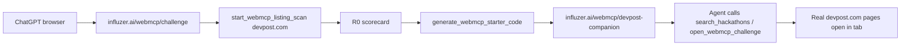

# WebMCP Challenge Demo Setup

> **Purpose:** Everything you need to record the demo and submit to Devpost **later today**.  
> **Recommended narrative:** Devpost meta-demo (scan → codegen → companion → agent navigates real Devpost).  
> **Fallback narrative:** Agent Discovery Copilot (discover stack → open WebMCP site).

---

## Quick links

| What | URL |
|------|-----|
| **Judge / demo page** | https://www.influzer.ai/webmcp/challenge |
| **WebMCP directory** | https://www.influzer.ai/webmcp |
| **Classic MCP directory** | https://www.influzer.ai/mcp |
| **Tool manifest API** | https://www.influzer.ai/api/webmcp/v1/self |
| **Challenge submission (Devpost)** | https://webmcp.devpost.com/ |
| **OpenAI challenge page** | https://openai.com/webmcp-challenge/ |
| **Repo** | https://github.com/rmencke2/logo |
| **Devpost target (scan)** | https://devpost.com/ |
| **Challenge host page (scan)** | https://webmcp.devpost.com/ |

**Deadline:** September 3, 2026 @ 1:00 PM PT

---

## One-line pitches (pick one for video + Devpost)

### Primary — Devpost meta (recommended)

> *The WebMCP Challenge lives on Devpost — but Devpost has zero WebMCP tools. We scanned it, generated the integration, shipped a companion page, and let ChatGPT navigate hackathons and the submission flow without tab-hopping.*

### Secondary — Agent Discovery Copilot (already built)

> *Build your app inside ChatGPT while your agent discovers 358 WebMCP websites and 14k MCP servers from Influzer — inspect schemas, pick a stack, open the site, wire MCP — without leaving the chat.*

### Combined (best Devpost write-up)

> *Build in ChatGPT, discover WebMCP + MCP tools to compose your stack, then bootstrap WebMCP for any site (we demo on Devpost itself) — scan, generate starter code, agent-enable, list in the directory.*

---

## What is live today (Aug 30)

### Deployed and working

- [x] `/webmcp/challenge` — judge page + live tool console
- [x] **13 WebMCP tools** on influzer.ai (`public/js/influzer-webmcp.js`)
- [x] WebMCP catalog: **358 sites**
- [x] Classic MCP catalog: **14,309 servers**
- [x] Scan + scorecard: `/webmcp/submit` + API `POST /api/webmcp/v1/scans`
- [x] Agent listing tools: `start_webmcp_listing_scan`, `get_webmcp_listing_scan`
- [x] Challenge docs: `docs/WEBMCP_CHALLENGE.md`, `WEBMCP_CHALLENGE_DEVPOST.md`, `WEBMCP_CHALLENGE_VIDEO.md`

### Not built yet (Devpost codegen path)

- [ ] `generate_webmcp_starter_code` tool
- [ ] `services/webmcp/starterGenerator.js` (heuristic codegen from scan)
- [ ] `/webmcp/devpost-companion` live page
- [ ] Devpost-specific video script in repo (this note replaces it for now)

> [!warning] If companion page isn't built before recording
> Use **Plan B** below — the discovery copilot demo is fully functional without codegen. You can still *mention* the Devpost R0 scan in voiceover and show a scan result from `/webmcp/submit`.

---

## Devpost scan facts (verified Aug 28)

Live headless scan via Influzer scanner:

| URL | In catalog? | Tools | Grade |
|-----|-------------|-------|-------|
| https://devpost.com/ | No | **0** | **R0** |
| https://webmcp.devpost.com/ | No | **0** | **R0** |

**Pages scanned on devpost.com (sample):**

- `/` — "Devpost - The home for hackathons"
- `/hackathons` — "New & upcoming hackathons"
- `/software` — "Software projects from hackathons"
- `/webmcp`, `/webmcp/demo`, `/mcp` — no tools (404/empty)

**Key insight:** You **cannot** inject WebMCP into Devpost's domain without their cooperation. Demo = scan real Devpost + ship a **companion page you control** that implements recommended tools and deep-links to Devpost.

> [!note] Disclaimer (say in video + Devpost)
> *Unofficial companion demo — not affiliated with or endorsed by Devpost. Shows recommended WebMCP integration for a site that currently has none.*

---

## Demo architecture (Devpost path)



### Recommended companion tools (when built)

| Tool | Kind | Behavior |
|------|------|----------|
| `get_devpost_overview` | answer | Site title, description, main sections from scan |
| `search_hackathons` | act | Navigate to `https://devpost.com/hackathons` with query param or search URL |
| `list_upcoming_hackathons` | answer | Structured cards (cached snapshot from scan or static seed data) |
| `open_hackathon` | act | `window.location` to a hackathon URL |
| `open_webmcp_challenge` | act | Navigate to `https://webmcp.devpost.com/` |
| `get_submission_checklist` | answer | Challenge requirements, deadline, links |

**Companion URL (target when built):** `https://www.influzer.ai/webmcp/devpost-companion`

---

## Pre-recording checklist

### Environment

- [ ] ChatGPT **desktop app** updated
- [ ] In-app **browser** works (Settings → enable if needed)
- [ ] Alternative: Chrome 149+ with `chrome://flags/#enable-webmcp-testing` → restart
- [ ] https://www.influzer.ai/webmcp/challenge loads
- [ ] Status badge on page shows tools registered (not "Starting…" forever)
- [ ] 1080p display, notifications off, mic tested
- [ ] Rehearse once end-to-end (~5 min dry run)

### Verify tools in DevTools (optional)

On `/webmcp/challenge`, open console:

```javascript
await document.modelContext.getTools()
// Should return 13 tools including recommend_agent_stack, start_webmcp_listing_scan
```

### Manual console fallback

If ChatGPT won't call tools, use presets on the challenge page:

1. **Preset: recommend stack** → Run
2. **Preset: search WebMCP** → Run
3. **Preset: get MCP server** → Run

---

## Recording script — Plan A: Devpost meta (~2:45)

> **Lead with Act 2** if short on time — it's the memorable hook.

### 0:00–0:15 — Hook

**VO:**  
*"The WebMCP Challenge is hosted on Devpost. We scanned Devpost. Zero agent tools. Here's how we fixed that in one ChatGPT session."*

**Visual:** Title card → ChatGPT new chat

---

### 0:15–0:45 — Scan Devpost (R0)

**Visual:** ChatGPT → in-app browser → `https://www.influzer.ai/webmcp/challenge`

**Type:**

```
Scan https://devpost.com for WebMCP tools. The WebMCP Challenge is hosted there — does Devpost itself expose any agent tools?
```

**Expected:** Agent calls `start_webmcp_listing_scan` (needs your email + `user_confirmed: true`) then `get_webmcp_listing_scan`.

**If agent asks to confirm:** Say yes; provide your email.

**Poll prompt if slow:**

```
Check the scan status again — show me the scorecard and tool count.
```

**Visual:** Zoom on **R0**, **0 tools**, findings list.

**VO:**  
*"Grade R0. The hackathon platform has no WebMCP surface — yet."*

**Manual fallback:** Open https://www.influzer.ai/webmcp/submit in another tab, submit `https://devpost.com`, show result.

---

### 0:45–1:30 — Generate + companion (if built)

**Type:**

```
Generate WebMCP starter code for Devpost — hackathon search, open a hackathon, and navigate to the WebMCP challenge submission page.
```

**Expected:** `generate_webmcp_starter_code` OR agent uses scan result + suggests integration.

**Visual:** Show generated JS snippet briefly → open companion page.

**Type:**

```
Open the Devpost WebMCP companion page and search hackathons for "AI agents".
```

**Expected tools:** `search_hackathons`, `open_webmcp_challenge`

**VO:**  
*"We can't deploy on their domain — but this companion implements the integration we'd recommend. The agent searches hackathons and opens the challenge submission — same browser, structured tools."*

> [!tip] If companion not built
> Skip to **0:45–1:15 Plan B discovery demo** below, then return for close at 2:30.

---

### 1:30–2:15 — Discovery copilot (shows breadth)

**Type:**

```
Use recommend_agent_stack — I'm building a hackathon submission assistant with Postgres and email. Show WebMCP sites and MCP servers to combine.
```

**Follow-up:**

```
Get tool schemas for the top WebMCP site and setup details for the top MCP server.
```

**Optional:**

```
Open the best WebMCP site in this tab.
```

**VO:**  
*"Same session — Influzer searches three hundred fifty-eight WebMCP sites and fourteen thousand MCP servers while you build."*

---

### 2:15–2:30 — WebMCP proof

**Visual:** Quick cut to GitHub `public/js/influzer-webmcp.js` → scroll `registerTool`

**VO:**  
*"Real document.modelContext.registerTool — thirteen tools, answer and act kinds, open source."*

**Optional:** DevTools `getTools()` on challenge page.

---

### 2:30–2:45 — Close

**VO:**  
*"Agent Discovery Copilot — scan any site, bootstrap WebMCP, discover tools, build in ChatGPT. influzer.ai/webmcp/challenge."*

**End card:** URL + GitHub + *"Unofficial Devpost companion demo"*

---

## Recording script — Plan B: Discovery only (~2:45)

Use if codegen/companion isn't ready. Fully working today.

### Prompts (copy-paste in order)

**1. Stack recommendation**

```
Use recommend_agent_stack — I'm building a booking app with calendar sync and email reminders. Show WebMCP sites and MCP servers I should combine.
```

**2. Inspect schemas**

```
Get full tool schemas for the top WebMCP site and setup details for the top MCP server.
```

**3. Navigate**

```
Open the best WebMCP site in this tab.
```

**4. Bonus — listing scan**

```
Submit https://example.com for WebMCP listing — my email is YOUR_EMAIL@domain.com. I confirm.
```

**5. Bonus — Devpost mention (voiceover only)**

```
While showing scan: "We also scanned devpost.com — R0, zero tools — the challenge host could use WebMCP too."
```

---

## All 13 live WebMCP tools

| Tool | Kind | Use in demo |
|------|------|-------------|
| `get_influzer_overview` | answer | Entry / orientation |
| `get_webmcp_directory_stats` | answer | "358 sites, 14k MCP" |
| `search_webmcp_sites` | answer | Find sites by keyword |
| `get_webmcp_site` | answer | Full schemas for one site |
| `search_webmcp_tools` | answer | Search by capability |
| `search_mcp_servers` | answer | Classic MCP search |
| `get_mcp_server` | answer | Install steps for one server |
| `recommend_agent_stack` | answer | **Primary demo tool** |
| `open_webmcp_site` | act | Navigate tab to external site |
| `start_webmcp_listing_scan` | act | Submit URL for scan (needs confirm + email) |
| `get_webmcp_listing_scan` | answer | Poll scan / scorecard |
| `list_latest_insights` | answer | Agent briefings |
| `navigate_influzer` | act | Same-origin nav |

**Manifest:** `data/influzer-webmcp-tools.json`  
**Implementation:** `public/js/influzer-webmcp.js`

---

## Devpost submission checklist

### Required fields

- [ ] **Project name:** Agent Discovery Copilot (by Influzer.ai)
- [ ] **Tagline:** Discover WebMCP sites + MCP servers while you build — inside ChatGPT's browser.
- [ ] **Live URL:** https://www.influzer.ai/webmcp/challenge
- [ ] **Video URL:** (YouTube public link after upload)
- [ ] **Repo:** https://github.com/rmencke2/logo
- [ ] **License:** ISC

### Judge testing block (paste into Devpost)

**Browser:** ChatGPT desktop in-app browser OR Chrome 149+ with `#enable-webmcp-testing`  
**Auth:** None

**Prompt 1:**  
*Use recommend_agent_stack — I'm building an e-commerce app with cart and Postgres. Show WebMCP sites and MCP servers to combine.*

**Prompt 2:**  
*Get tool schemas for the top WebMCP site and setup details for the top MCP server.*

**Prompt 3:**  
*Open the best WebMCP site in this tab.*

**Optional Prompt 4 (Devpost angle):**  
*Scan https://devpost.com for WebMCP tools and show the scorecard.*

### Full Devpost copy

See [[../WEBMCP_CHALLENGE_DEVPOST]] or `docs/WEBMCP_CHALLENGE_DEVPOST.md`

---

## Troubleshooting

| Problem | Fix |
|---------|-----|
| Tools not registering | Refresh page; check console for JS errors; try Chrome flag |
| Agent won't call tools | Be explicit: *"Use the recommend_agent_stack tool on this page"* |
| `start_webmcp_listing_scan` blocked | Must say *"I confirm"*; provide valid email; agent needs `user_confirmed: true` |
| Scan slow (~30–60s) | Use `get_webmcp_listing_scan` with scan ID; or pre-run scan before recording |
| `open_webmcp_site` fails | Pick a site from `recommend_agent_stack` results that has `host` field; try influzer.ai itself |
| External site has no tools | Normal — voiceover: *"Now we'd use that site's own tools if registered"* |
| Rate limit on scans | 30/hour per IP; pre-scan before recording |
| ChatGPT browser flaky | Fall back to manual console presets on challenge page |

---

## Implementation backlog (ask agent to build before demo)

If you want the full Devpost narrative live, request this in a follow-up session:

1. **`services/webmcp/starterGenerator.js`**
   - Input: scan result (pages, anchors, forms, titles)
   - Output: `{ tools_suggested, starter_js, install_steps }`

2. **API:** `GET /api/webmcp/v1/scans/:id/starter`

3. **WebMCP tool:** `generate_webmcp_starter_code`
   - Args: `{ url }` or `{ scan_id }`

4. **Page:** `/webmcp/devpost-companion`
   - Registers: `search_hackathons`, `open_webmcp_challenge`, `get_devpost_overview`
   - Deep-links to real Devpost URLs

5. **Update:** `views/webmcp-challenge.ejs` — add Devpost prompt examples

6. **Branch:** `cursor/webmcp-devpost-companion-d046`

---

## Repo file map

| File | Purpose |
|------|---------|
| `public/js/influzer-webmcp.js` | Tool registration |
| `data/influzer-webmcp-tools.json` | Tool manifest |
| `views/webmcp-challenge.ejs` | Judge demo page |
| `services/webmcp/scanner.js` | Headless WebMCP scan |
| `services/webmcp/scorecard.js` | R0–R5 grading |
| `services/webmcp/scanService.js` | Scan orchestration |
| `docs/WEBMCP_CHALLENGE.md` | Submission README |
| `docs/WEBMCP_CHALLENGE_DEVPOST.md` | Devpost copy |
| `docs/WEBMCP_CHALLENGE_VIDEO.md` | Original video shot list |

---

## Local verify (before recording)

```bash
npm run test-influzer-webmcp
node scripts/demo-influzer-webmcp.js
```

Quick scan test (requires Chrome/Chromium on machine):

```bash
node -e "
const { scanWebsite } = require('./services/webmcp/scanner');
scanWebsite({ url: 'https://devpost.com/' }).then(r =>
  console.log(r.host, r.tools.length, 'tools', r.pages.map(p=>p.path))
);
"
```

---

## Session plan for later today

| Time block | Task |
|------------|------|
| **1** | Pre-flight checklist; open challenge page; dry-run Plan B prompts |
| **2** | (Optional) Build devpost-companion if agent session available |
| **3** | Rehearse full script once |
| **4** | Record video (2–3 takes max) |
| **5** | Upload YouTube (public) |
| **6** | Submit / update https://webmcp.devpost.com/ |
| **7** | Paste video URL into `docs/WEBMCP_CHALLENGE.md` |

---

## Notes / ideas

- **Meta hook is strong** — judges are literally on Devpost reviewing submissions
- **Don't claim** you modified Devpost.com itself
- **Pre-run** a devpost.com scan before recording so you have a scan ID ready
- **Email for scans:** use a real inbox — scan report email is sent on completion
- **Counts may drift** — check live: `/api/webmcp/v1/stats` and `/api/mcp/catalog` header

---

## Related notes

- [[../WEBMCP_CHALLENGE]]
- [[../WEBMCP_CHALLENGE_DEVPOST]]
- [[../WEBMCP_CHALLENGE_VIDEO]]

#webmcp #demo #devpost #influzer #challenge #obsidian
